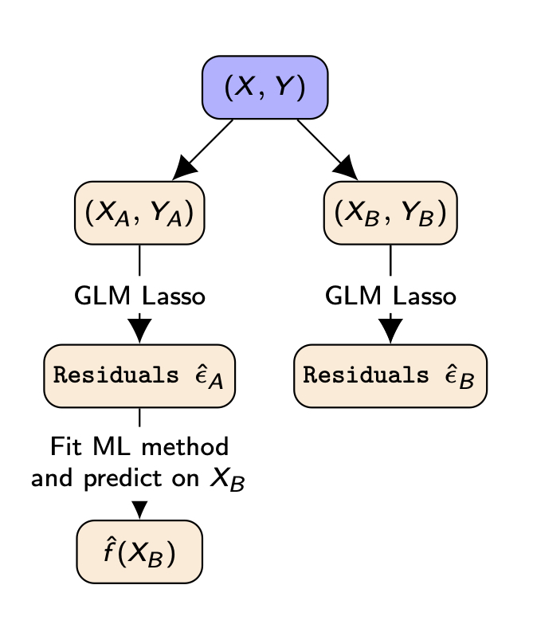

# GRPtests
Goodness-of-fit testing in high-dimensional generalized linear models

The code in this repository reproduces empirical results from Section 4 of [Janková, J., Shah, R. D., Bühlmann, P. and Samworth, R. J., Goodness-of-fit testing in high-dimensional generalized linear models (2020), ArXiv: 1908.03606](https://arxiv.org/abs/1908.03606).<br/><br/>
The code (implemented in R) is available in <br/><br/>
[Example_Section_4-1](https://github.com/jankova/GRPtests/blob/master/Example_Section_4-1.R),<br/>
[Example_Section_4-2](https://github.com/jankova/GRPtests/blob/master/Example_Section_4-1.R),<br/>
[Example_Section_4-3](https://github.com/jankova/GRPtests/blob/master/Example_Section_4-1.R),<br/>
[Example_Section_4-4](https://github.com/jankova/GRPtests/blob/master/Example_Section_4-1.R).<br/>

## Method heuristics
Let Y be the target vector and let X be the matrix with features as columns. 

Split the observations randomly into two parts (X_A, y_A) and (X_B, y_B). 

Fit a GLM regression of y_A on X_A and y_B on X_B and for both fitted regressions, compute the Pearson residuals
R_A and R_B.

The main idea of the method is then as follows: if the logistic regression model was not a good fit, we would expect that some nonlinear signal was left in
the residuals.
Therefore we use a ML method (by default the random forest, but any method may be used) to predict the leftover signal from R_A.

Using the random forest to fit R_A on X_A, we obtain a prediction function f_A(). 
If there was indeed nonlinear signal left in the residuals and the random forest picked it up,
then this signal should also be present in the residuals from part B. 
Thus if we predict the random forest f_A() on X_B and compute the scalar product of f_A(X_B) and R_B, this would be large and we would reject the null hypothesis.

A schematic illustration of the procedure is pictured below.



## Installation

Installation in R from this github repository:

```
install.packages(devtools)

library(devtools)

install_github("jankova/GGMinference_R_package/GGMinference")
```

Installation in R from CRAN repository:

```
install.packages("GRPtests")

library("GRPtests")
```
